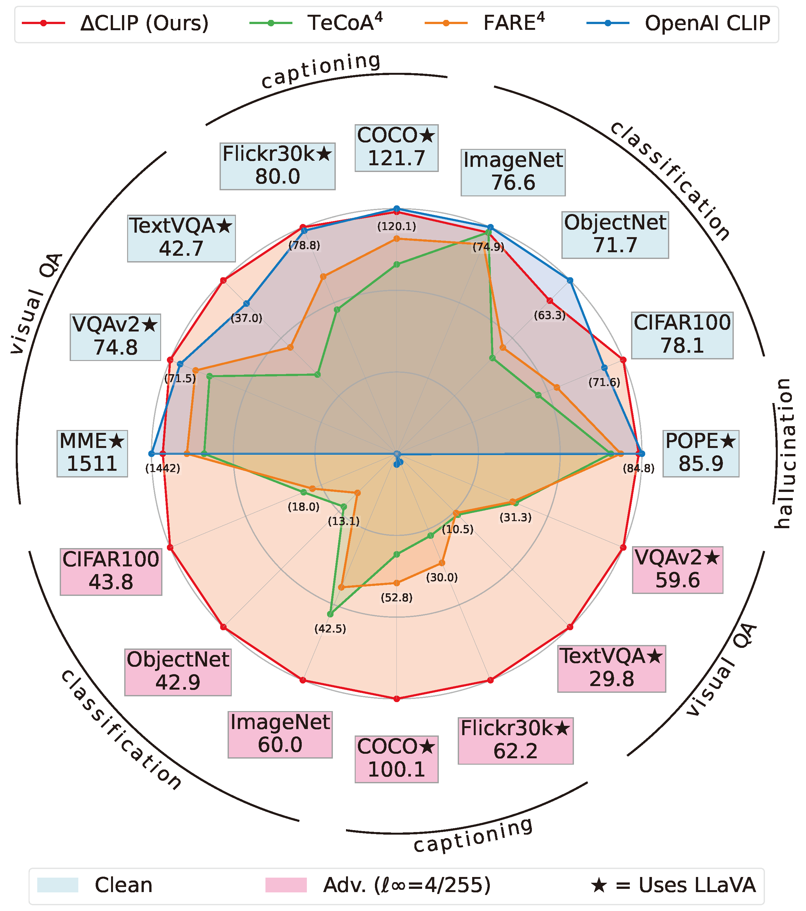
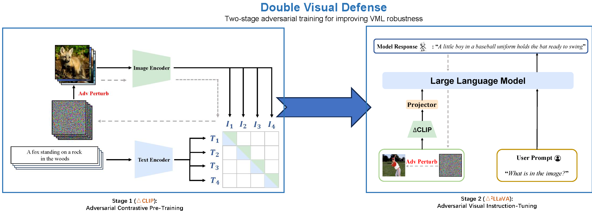

# RobustVLM
[[Paper]](https://arxiv.org/abs/2501.09446) [[Project Page]](https://doublevisualdefense.github.io/) [[BibTeX]](#citation) 

This repository contains code for the paper "Double Visual Defense: Adversarial Pre-training and Instruction Tuning for Improving Vision-Language Model Robustness".

- The `CLIP_benchmark` folder contains zero-shot evaluation code of both clean performances and adversarial robustness of CLIP models.
- The `RobustVLM` folder contains the robustness evaluation code of VLM Captioning and VQA and VLM Targeted Attacks.
- The `Open-LLaVA-NeXT` folder contains the training code of $\Delta^2$LLaVA.


<p align="center">
    
    <br>
</p>

******

<p align="center">
    
</p>

## Introduction Highlights
This paper studies the robustness of vision-language models against adversarial visual perturbations, and introduces a novel double visual defense for improving it. 
Rather than the previous works' lightweight adversarial fine-tuning of a pre-trained CLIP model, we opt for adversarial vision-language pre-training on web-scale data. 
We then add an extra layer of defense by introducing adversarial visual instruction tuning. 
The models that result from each stage, $\Delta$ CLIP and $\Delta^2$ LLaVA, 
show substantially enhanced robustness and set a new state-of-the-art in adversarial defense for vision-language models. 
For example, $\Delta$ CLIP surpasses the previous best models on ImageNet-1k by ~20% in terms of adversarial robustness. 
Similarly, compared to prior art, $\Delta^2$ LLaVA brings a ~30% robustness improvement to image captioning task and a ~20% robustness improvement to visual question answering task. 
Furthermore, our models exhibit stronger zero-shot recognition capability, fewer hallucinations, and superior reasoning performance compared to baselines. 


## **Model Zoo**
For evaluating $\Delta$ CLIP model, please check [clip.md](docs/clip.md).
For evaluating $\Delta^2$ LLaVA model, please check [robustness.md](docs/robustness.md).

| Model            | Link                        |
|------------------|-----------------------------|
| $\Delta$ CLIP    | [🤗 HuggingFace Model](https://huggingface.co/collections/zw123/delta-clip-67d770f8868b5bb02ee99041) |
| $\Delta^2$ LLaVA | [🤗 HuggingFace Model](https://huggingface.co/collections/zw123/delta2-llava-67d78405b0ef537fd03f31b9) |


## **Install**
The installation process largely follows the [LLaVA](https://github.com/haotian-liu/LLaVA) and [Open-LLaVA-NeXT](https://github.com/xiaoachen98/Open-LLaVA-NeXT) repo.

1. Clone this repository and navigate to Double_Visual_Defense folder
```bash
git clone https://github.com/zw615/Double_Visual_Defense.git
cd Double_Visual_Defense/Open-LLaVA-NeXT
```

2. Install Package
```Shell
conda create -n double_visual_defense python=3.10 -y
conda activate double_visual_defense
pip install -e .
```

3. Install additional packages for training
```
pip install -e ".[train]"
yes | conda install -c conda-forge libstdcxx-ng==14.2.0
pip install flash-attn==2.6.3 --no-build-isolation
```

## **Delta2 LLaVA Training**

### **Data Preparation**
The data preparation process of LLaVA-v1.5 largely follows the [LLaVA](https://github.com/haotian-liu/LLaVA) repo.

### **Training Overview**
The following presents a breif overview of how to train $\Delta^2$LLaVA models. 
For more details, refer to the [LLaVA](https://github.com/haotian-liu/LLaVA) and [Open-LLaVA-NeXT](https://github.com/xiaoachen98/Open-LLaVA-NeXT) repo.

It is worth mentioning that to train on fewer GPUs with less memories, you can reduce the `per_device_train_batch_size` and increase the `gradient_accumulation_steps` accordingly. 
Always keep the global batch size the same: `per_device_train_batch_size` x `gradient_accumulation_steps` x `num_gpus`.
However, due to a known [bug](https://huggingface.co/blog/gradient_accumulation) of the gradient accumulation step in earlier version of [Transformers](https://github.com/huggingface/transformers),
we also implemented a manual monkey patch specifically for llama models. See [llama_grad_accum_monkey_patch.py](llava/train/llama_grad_accum_monkey_patch.py).
Upgrading to the latest Transformers version might solve the issue, but we've not tested it. 

#### Pretrain
Please download the 558K subset of the LAION-CC-SBU dataset with BLIP captions [here](https://huggingface.co/datasets/liuhaotian/LLaVA-Pretrain).

Each extra number of PGD forward-backward step brings 1x more compute upon vanilla LLaVA training, and the total training time increases accordingly.
Note that *Pretrain takes around 5.5 hours for LLaVA-v1.5-13B on 8x A100 (80G), due to the increased resolution to 336px. It takes around 3.5 hours for LLaVA-v1.5-7B.*

Training script with DeepSpeed ZeRO-2: [`adv_pretrain_template_multinode.sh`](scripts/v1_5/train/adv_pretrain_template_multinode.sh).

- `--mm_projector_type mlp2x_gelu`: the two-layer MLP vision-language connector.
- `--pretrain_vision_tower /path/to/delta_clip_h14_336.pt`: $\Delta$CLIP-H/14-336.
- `--image_processor_name_or_path ./clip_preprocess/open_clip_336/preprocessor_config.json`: preprocess config of $\Delta$CLIP-H/14-336.
- `--epsilon`: the PGD attack radius.
- `--step_size`: the PGD attack step size.
- `--num_steps`: the PGD attack number of steps.

#### Visual Instruction Tuning

1. Prepare data

Please download the annotation of the final mixture LLaVA-v1.5 instruction tuning data [llava_v1_5_mix665k.json](https://huggingface.co/datasets/liuhaotian/LLaVA-Instruct-150K/blob/main/llava_v1_5_mix665k.json), and download the images from constituting datasets:

- COCO: [train2017](http://images.cocodataset.org/zips/train2017.zip)
- GQA: [images](https://downloads.cs.stanford.edu/nlp/data/gqa/images.zip)
- OCR-VQA: [download script](https://drive.google.com/drive/folders/1_GYPY5UkUy7HIcR0zq3ZCFgeZN7BAfm_?usp=sharing), **we save all files as `.jpg`**
- TextVQA: [train_val_images](https://dl.fbaipublicfiles.com/textvqa/images/train_val_images.zip)
- VisualGenome: [part1](https://cs.stanford.edu/people/rak248/VG_100K_2/images.zip), [part2](https://cs.stanford.edu/people/rak248/VG_100K_2/images2.zip)

After downloading all of them, organize the data as follows in `./playground/data`,

```
├── coco
│   └── train2017
├── gqa
│   └── images
├── ocr_vqa
│   └── images
├── textvqa
│   └── train_images
└── vg
    ├── VG_100K
    └── VG_100K_2
```

2. Start training!

It is not recommended to use any clean pretrained LLaVA projectors as they are not adversarially robust.

Due to memory cost, we default to Low-rank Adaptation (LoRA) technique in $\Delta^2$LLaVA training. But feel free to try fully fine-tuning.

Each extra number of PGD forward-backward step brings 1x more compute upon vanilla LLaVA training, and the total training time increases accordingly.
Note that *Visual instruction tuning takes around 20 hours for LLaVA-v1.5-13B on 8x A100 (80G), due to the increased resolution to 336px. It takes around 10 hours for LLaVA-v1.5-7B on 8x A100 (40G).*

Training script with DeepSpeed ZeRO-2: [`adv_finetune_lora_template_multinode.sh`](scripts/v1_5/train/adv_finetune_lora_template_multinode.sh).

New options to note:

- `--unfreeze_mm_vision_tower True`: finetune vision tower.
- `--mm_vision_tower_lr 1e-6`: learning rate of vision tower.
- `--image_aspect_ratio pad`: this pads the non-square images to square, instead of cropping them; it slightly reduces hallucination.
- `--group_by_modality_length True`: this should only be used when your instruction tuning dataset contains both language (e.g. ShareGPT) and multimodal (e.g. LLaVA-Instruct). It makes the training sampler only sample a single modality (either image or language) during training, which we observe to speed up training by ~25%, and does not affect the final outcome.
- `--epsilon`: the PGD attack radius.
- `--step_size`: the PGD attack step size.
- `--num_steps`: the PGD attack number of steps.

### **Evaluation**
In our experiments, we opted for the awesome [lmms-eval](https://github.com/EvolvingLMMs-Lab/lmms-eval) for efficient clean performance evaluation.
You may also use the evaluation script from the original [LLaVA](https://github.com/haotian-liu/LLaVA) and [Open-LLaVA-NeXT](https://github.com/xiaoachen98/Open-LLaVA-NeXT) repo.

It should be relatively easy to adapt to those repositories since our trained LLaVA model can be loaded using the following sample code
```
from llava.model.builder import load_pretrained_model
model_path=/path/to/delta2_llava_8/weight
model_base='lmsys/vicuna-7b-v1.5'
model_name='llava-v1.5-7b'
tokenizer, model, image_processor, context_len = load_pretrained_model(model_path, model_base, model_name)
```

## **Acknowledgments**
This repo is built upon [LLaVA](https://github.com/haotian-liu/LLaVA), [Open-LLaVA-NeXT](https://github.com/xiaoachen98/Open-LLaVA-NeXT), [CLIP_benchmark](https://github.com/LAION-AI/CLIP_benchmark), [RobustVLM](https://github.com/chs20/RobustVLM).
Huge thanks for their great contribution to the open-source community!

## **Release**
The code of this site is released under the MIT license.

LLNL-Code-2002980

We would like to thank TPU Research Cloud (TRC) program, Google Cloud Research Credits program, and AWS Cloud Credit for Research program for partially supporting our computing needs. 
Cihang Xie is partially support by a gift from Open Philanthropy. 
This work is partially based upon the work supported by the National Center for Transportation Cybersecurity and Resiliency (TraCR) (a U.S. Department of Transportation National University Transportation Center) headquartered at Clemson University, Clemson, South Carolina, USA. 
Any opinions, findings, conclusions, and recommendations expressed in this material are those of the author(s) and do not necessarily reflect the views of TraCR, and the U.S. Government assumes no liability for the contents or use thereof. 

## **Citation**
If you find this repository useful, please consider citing our paper:
```bibtex
@article{wang2025double,
  title={Double Visual Defense: Adversarial Pre-training and Instruction Tuning for Improving Vision-Language Model Robustness},
  author={Wang, Zeyu and Xie, Cihang and Bartoldson, Brian and Kailkhura, Bhavya},
  journal={arXiv preprint arXiv:2501.09446},
  year={2025}
}

```